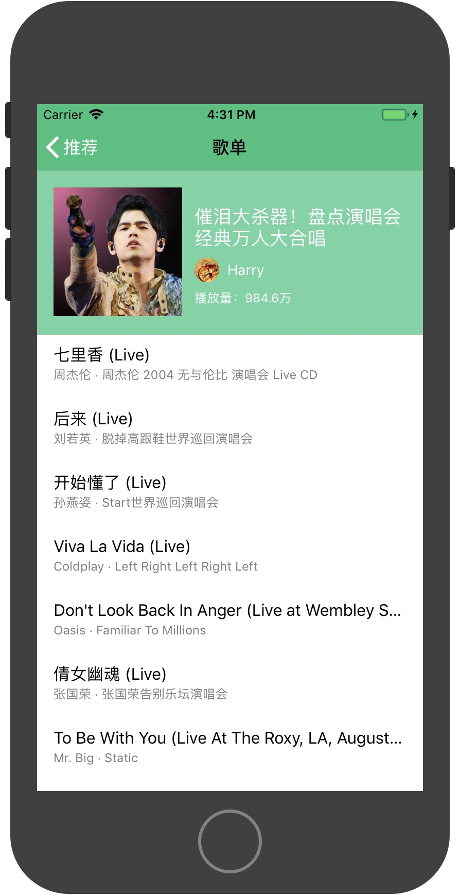
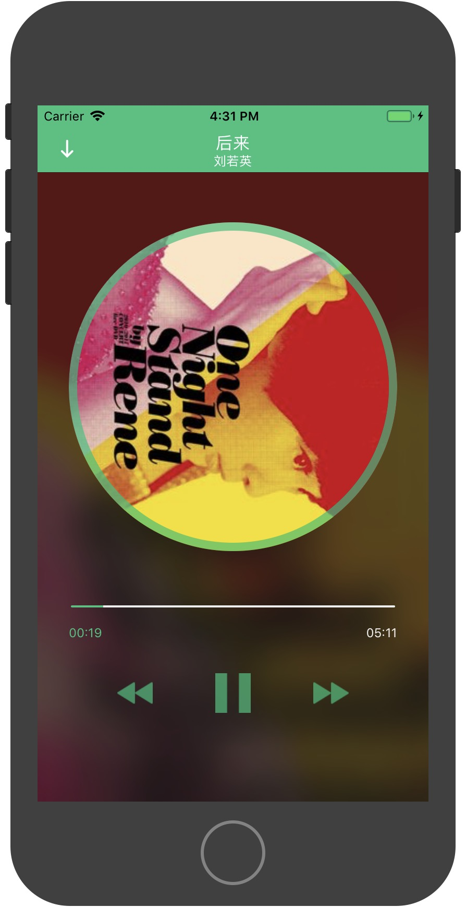

# MusicPlayer
业务时间，学习了iOS相关知识，就想着自己也写一个音乐播放器。

动手写写，还是有很多收获的：

* 更加熟练了swift，包括很多高级特性，比如集合，协议，结构体，类，闭包，值语义，引用语义，可选值等
* 弄清楚了h5与native通信原理，自己也实现了swift版本的[WebViewJavascriptBridge](https://github.com/snayan/MusicPlayer/tree/master/MusicPlayer/bridge)
* 大致了解了iOS开发的基本知识

效果图如下：

#### 整理的参考文档清单

[Start Developing iOS Apps (Swift)](https://developer.apple.com/library/archive/referencelibrary/GettingStarted/DevelopiOSAppsSwift/index.html#//apple_ref/doc/uid/TP40015214-CH2-SW1)

[Auto Layout Guide](https://developer.apple.com/library/archive/documentation/UserExperience/Conceptual/AutolayoutPG/index.html#//apple_ref/doc/uid/TP40010853)

[App Programming Guide for IOS](https://developer.apple.com/library/archive/documentation/iPhone/Conceptual/iPhoneOSProgrammingGuide/Introduction/Introduction.html#//apple_ref/doc/uid/TP40007072-CH1-SW1)

[Cocoa Application Competencies for iOS](https://developer.apple.com/library/archive/documentation/General/Conceptual/Devpedia-CocoaApp/Introduction.html#//apple_ref/doc/uid/TP40009071-CH23-DontLinkElementID_2)

[Cocoa Core Competencies](https://developer.apple.com/library/archive/documentation/General/Conceptual/DevPedia-CocoaCore/Introduction.html#//apple_ref/doc/uid/TP40008195-CH68-DontLinkElementID_2)

[View Programming Guide for IOS](https://developer.apple.com/library/archive/documentation/WindowsViews/Conceptual/ViewPG_iPhoneOS/Introduction/Introduction.html#//apple_ref/doc/uid/TP40009503-CH1-SW2)

[View Controller Programming Guide for IOS](https://developer.apple.com/library/archive/featuredarticles/ViewControllerPGforiPhoneOS/index.html#//apple_ref/doc/uid/TP40007457)

[Scroll View Programming Guide for iOS](https://developer.apple.com/library/archive/documentation/WindowsViews/Conceptual/UIScrollView_pg/Introduction/Introduction.html#//apple_ref/doc/uid/TP40008179)

[Text Programming Guide for iOS](https://developer.apple.com/library/archive/documentation/StringsTextFonts/Conceptual/TextAndWebiPhoneOS/Introduction/Introduction.html#//apple_ref/doc/uid/TP40009542)

[Collection View Programming Guide for iOS](https://developer.apple.com/library/archive/documentation/WindowsViews/Conceptual/CollectionViewPGforIOS/Introduction/Introduction.html)

[Table View Programming Guide for iOS](https://developer.apple.com/library/archive/documentation/UserExperience/Conceptual/TableView_iPhone/TableViewCells/TableViewCells.html#//apple_ref/doc/uid/TP40007451-CH7)

[Drawing and Printing Guide for IOS](https://developer.apple.com/library/archive/documentation/2DDrawing/Conceptual/DrawingPrintingiOS/Introduction/Introduction.html#//apple_ref/doc/uid/TP40010156)

[**Event Handling Guide for iOS**.]

[Location and Maps Programming Guide](https://developer.apple.com/library/archive/documentation/UserExperience/Conceptual/LocationAwarenessPG/Introduction/Introduction.html#//apple_ref/doc/uid/TP40009497)

[Core Animation Programming Guide](https://developer.apple.com/library/archive/documentation/Cocoa/Conceptual/CoreAnimation_guide/Introduction/Introduction.html#//apple_ref/doc/uid/TP40004514)

[Core Animation Cookbook](https://developer.apple.com/library/archive/documentation/GraphicsImaging/Conceptual/CoreAnimation_Cookbook/Introduction/Introduction.html#//apple_ref/doc/uid/TP40005406)

[Advanced Memory Management Programming Guide](https://developer.apple.com/library/archive/documentation/Cocoa/Conceptual/MemoryMgmt/Articles/MemoryMgmt.html#//apple_ref/doc/uid/10000011-SW1)

[Bundle Programming Guide](https://developer.apple.com/library/archive/documentation/CoreFoundation/Conceptual/CFBundles/Introduction/Introduction.html#//apple_ref/doc/uid/10000123i)

[Resource Programming Guide](https://developer.apple.com/library/archive/documentation/Cocoa/Conceptual/LoadingResources/Introduction/Introduction.html#//apple_ref/doc/uid/10000051i)

[Concurrency Programming Guide](https://developer.apple.com/library/archive/documentation/General/Conceptual/ConcurrencyProgrammingGuide/Introduction/Introduction.html#//apple_ref/doc/uid/TP40008091)

[Audio Session Programming Guide](https://developer.apple.com/library/archive/documentation/Audio/Conceptual/AudioSessionProgrammingGuide/Introduction/Introduction.html#//apple_ref/doc/uid/TP40007875)

[Core Audio Overview](https://developer.apple.com/library/archive/documentation/MusicAudio/Conceptual/CoreAudioOverview/Introduction/Introduction.html#//apple_ref/doc/uid/TP40003577-CH1-SW1)

[**URL Loading System Programming Guide**]

[File System Programming Guide](https://developer.apple.com/library/archive/documentation/FileManagement/Conceptual/FileSystemProgrammingGuide/Introduction/Introduction.html#//apple_ref/doc/uid/TP40010672)

[Human Interface Guidelines](https://developer.apple.com/design/human-interface-guidelines/ios/overview/themes/)

[Multimedia Programming Guide](https://developer.apple.com/library/archive/documentation/AudioVideo/Conceptual/MultimediaPG/UsingAudio/UsingAudio.html#//apple_ref/doc/uid/TP40009767-CH2)

[Cocoa Design Patterns](https://developer.apple.com/documentation/swift/cocoa_design_patterns)
